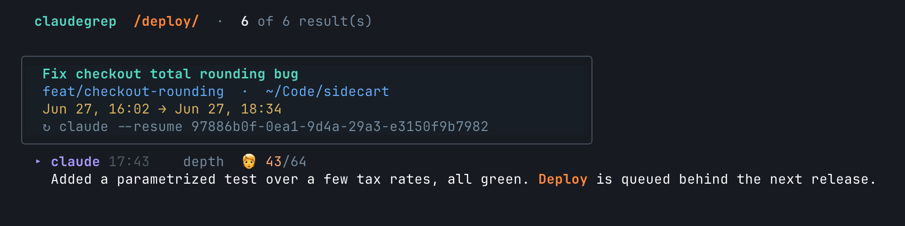
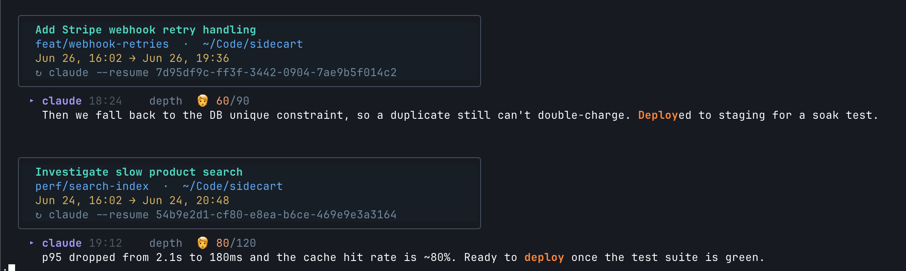
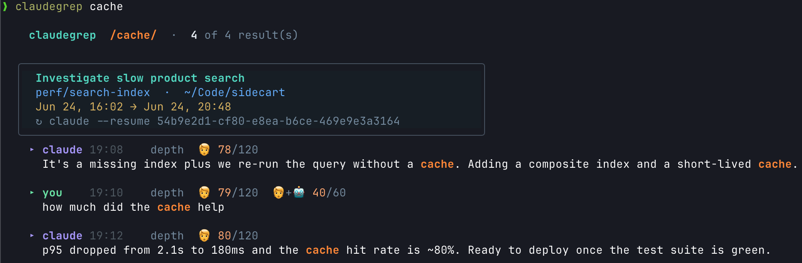

> [!NOTE]
> AI-written code, reviewed by a human.

# claudegrep

Search your Claude Code conversation logs (`~/.claude/projects/**/*.jsonl`) with
rich, session-grouped output — or plain, parse-friendly output for agents and
pipes. Built for the real job: *find which session something happened in and go
back to it.*

Sub-second over a multi-GB history, deterministic, stdlib-only Python.



*Every result groups by session (newest first) — topic, branch, working dir, time
range, and a `claude --resume` handle — with the match highlighted.*



*One query, the sessions it spans.*



*Each match shows how deep in the conversation it sits (🧑 message # / total, plus
user-turn position).*

## Install

A single self-contained script — needs only Python 3.10+.

### Homebrew

```bash
brew tap echochamber/tap
brew install claudegrep
```

### Install script

```bash
git clone https://github.com/echochamber/claudegrep.git
cd claudegrep && ./install.sh        # symlink `claudegrep` into ~/.local/bin
```

`--prefix DIR` changes the target; or skip install and run in place:
`./claudegrep "webhook"`.

**Optional dependencies** (external, with graceful fallbacks): **`ripgrep` (`rg`)**
is recommended — the fastest pre-filter; without it claudegrep falls back to
`grep`, then a pure-Python scan. **`less`** is used for paging when present.

## Usage

```bash
claudegrep "webhook"                 # search conversation text (user + assistant)
claudegrep -u "bulk price"           # user messages only
claudegrep -a "auth flow"            # assistant/agent messages only
claudegrep -p sidecart "auth"        # filter to a project (dir-name substring)
claudegrep -m 5 "TODO"               # cap to 5 results (-n is an alias)
claudegrep --all-content "redactSecrets"   # also search tool calls + tool output
claudegrep --last "error"            # only the most recent session
claudegrep --session <id> "deploy"   # one session
claudegrep --days 7 "incident"       # only the last 7 days
claudegrep                           # no pattern → recent-sessions dashboard
claudegrep --list-projects           # list projects
```

Every result carries a `claude --resume <id>` handle and the file path, so a
search is one copy-paste away from re-opening the session.

## Output modes (human vs agent)

`claudegrep` auto-detects how to render:

- **rich** — colorized, session-grouped boxes. Default on a terminal (TTY).
- **plain** — readable, ANSI-free, session-grouped, token-efficient. Default when
  piped or run by an agent (non-TTY).

Override the auto-detection with `--rich` / `--plain`, or set
`CLAUDEGREP_MODE=rich|plain`. Structured modes are explicit:

```bash
claudegrep --json "x"     # JSON array (for scripts/agents)
claudegrep --jsonl "x"    # JSON lines
claudegrep --grep "x"     # path:line:text (editor / fzf integration)
claudegrep --count "x"    # match counts per project
```

`NO_COLOR` (or `--no-color`) disables color; color is also auto-disabled off a TTY.

## Matching

Smart-case by default (case-insensitive unless your pattern has an uppercase
letter). `-s` forces case-sensitive, `-i` forces insensitive, `-F` treats the
pattern as a literal string, `-w` matches whole words. Patterns are regex by
default and one engine (Python `re`) decides matching **and** highlighting, so
what lights up is exactly what matched.

By default the **search surface** is conversation prose (user + assistant text).
Most of a transcript is tool calls and tool output; pass `--all-content` to
search those too (and `--include-subagents` to include subagent transcripts). If
a term is found only in tool content, the no-match message says so.

## How it works

Claude Code stores each session as one JSONL file under
`~/.claude/projects/<encoded-cwd>/<session-id>.jsonl` (subagent transcripts live
under `…/<session-id>/subagents/`). claudegrep:

1. **Discovers** sessions by walking that tree *without following symlinks*
   (worktree setups create hundreds of symlinked project dirs that point back to
   canonical ones — following them would return the same files many times over).
2. **Narrows** candidate files with a pre-filter, processing them newest-first in
   geometric batches with a recency-ordered early-stop, so common terms don't
   scan the whole corpus. Matches are read straight from the pre-filter's output —
   transcripts aren't re-read during the search.
3. **Enriches** only the handful of *displayed* sessions (one full parse each) to
   compute the depth index, topic, and time span, then sorts by true recency.

The pre-filter falls back through **ripgrep → grep → a pure-Python scan**: `rg`
is fastest, `grep` is a solid middle tier present on virtually every system, and
pure Python is the last resort. All three feed the same Python matcher, so
results are identical — only speed differs.

## Tests

```bash
pytest test_claudegrep.py
```

The suite (`pytest`, dev-only) exercises both the ripgrep and pure-Python paths.

## License

[Apache License 2.0](LICENSE).

claudegrep is original code and imports only the Python standard library. At
runtime it optionally shells out to two external programs as separate processes
(never linked or bundled): **ripgrep** (`rg`, MIT/Unlicense) as a search
pre-filter, and **less** (GPLv3) as a pager. Invoking these at arm's length via
`exec` imposes no licensing obligation on claudegrep, and both are optional with
pure-Python / unpaged fallbacks.
